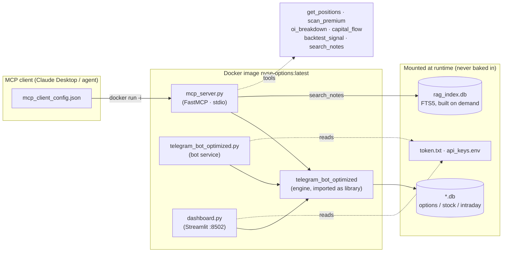

# Docker — NYSE_DATA options engine + MCP server

Containerized packaging for the options-intelligence engine. One image serves three
roles: the **MCP server** (default), the **Telegram bot**, and the **Streamlit dashboard**.

> **Build status:** the image definition mirrors the exact dependency set the engine
> already runs on (`requirements.txt` + `requirements_openbb.txt`), and `mcp_server.py`
> has been verified against the live DB in that same environment. The `docker build`
> itself has **not** been executed on the authoring machine (no Docker installed there) —
> run one `docker build` on a Docker-enabled host to confirm apt/pip resolution.

## Architecture



## Build

```bash
docker build -t nyse-options:latest .
```

Large image (the OpenBB stack is heavy). A slimmer MCP-only variant — dropping
`streamlit`, `matplotlib`, and the OpenBB stack, which the six MCP tools do not need —
is a worthwhile future optimization.

## Run the MCP server (on demand, stdio)

An MCP client launches the server itself; you rarely run it by hand. The `-i` flag is
required — the server speaks JSON-RPC on stdin/stdout.

```bash
docker run -i --rm \
  -v /host/Options_chain_data:/data \
  -e NYSE_DB_PATH=/data/US_data_OpenBB.db \
  nyse-options:latest
```

Client config (`mcp_client_config.example.json` ships both a native and a Docker entry):

```json
{
  "mcpServers": {
    "nyse-options-docker": {
      "command": "docker",
      "args": ["run", "-i", "--rm",
               "-v", "/host/Options_chain_data:/data",
               "-e", "NYSE_DB_PATH=/data/US_data_OpenBB.db",
               "nyse-options:latest"]
    }
  }
}
```

## Run the bot + dashboard (long-running)

```bash
docker compose up -d          # starts bot + dashboard
docker compose logs -f bot
# dashboard -> http://localhost:8502
```

Edit the `# <-- EDIT` host paths in `docker-compose.yml` first (the DB directory and the
secret files).

## Secrets & data

Nothing sensitive is ever copied into the image — `.dockerignore` excludes `token.txt`,
`api_keys.env*`, `dash_token.txt`, `us_bot_*.txt`, and all `*.db`. Provide them at runtime:

| What | How | Notes |
|------|-----|-------|
| Databases | bind-mount host dir → `/data`, set `NYSE_DB_PATH` | read/write for the bot; the MCP tools only read |
| Bot token | `-v ./token.txt:/app/token.txt:ro` | required only for the bot service, not the MCP server |
| API keys  | `-v ./api_keys.env:/app/api_keys.env:ro` | Finnhub etc.; macro lane is keyless |
| RAG index | none — `rag_index.db` is rebuilt inside the container on first `search_notes` | derived, disposable |

## Verify after building

```bash
# MCP server boots and lists its 6 tools (Ctrl-C to exit):
docker run -i --rm -v /host/Options_chain_data:/data nyse-options:latest <<<'{"jsonrpc":"2.0","id":1,"method":"tools/list"}'
```
